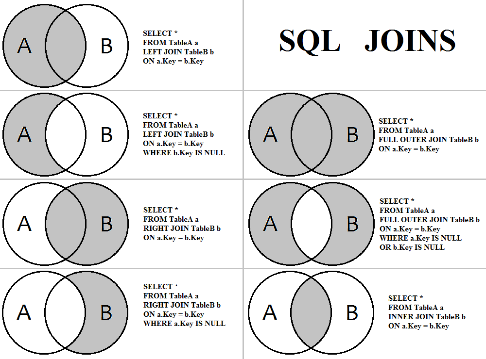

# SQL JOINS in Ruby on Rails

This guide demonstrates how to implement different types of SQL JOINs using Ruby on Rails Active Record.

## Assumptions

For these examples, we'll use two models:
- `Account` (Table A)
- `User` (Table B)

With the relationship: `User belongs_to :account` (users.account_id = accounts.id)




---

## 1. INNER JOIN

Returns only records that have matching values in both tables.

### SQL
```sql
SELECT *
FROM accounts a
INNER JOIN users b
ON a.id = b.account_id
```

### Rails Active Record
```ruby
# Using joins (INNER JOIN by default)
Account.joins(:users)

# Alternative: using includes with references
Account.includes(:users).references(:users).where.not(users: { id: nil })

# Raw SQL
Account.joins("INNER JOIN users ON accounts.id = users.account_id")
```

### Visual Representation
```
    A ∩ B (intersection)
```

---

## 2. LEFT JOIN (LEFT OUTER JOIN)

Returns all records from the left table (A) and matched records from the right table (B). Returns NULL for non-matching records from the right table.

### SQL
```sql
SELECT *
FROM accounts a
LEFT JOIN users b
ON a.id = b.account_id
```

### Rails Active Record
```ruby
# Using left_joins (Rails 5+)
Account.left_joins(:users)

# Using left_outer_joins (alias for left_joins)
Account.left_outer_joins(:users)

# Alternative: using includes
Account.includes(:users)

# Raw SQL
Account.joins("LEFT JOIN users ON accounts.id = users.account_id")
```

### Visual Representation
```
    A ∪ (A ∩ B) - All of A plus matches in B
```

---

## 3. LEFT JOIN with exclusion (LEFT OUTER JOIN with WHERE b.Key IS NULL)

Returns all records from the left table (A) that do NOT have a match in the right table (B).

### SQL
```sql
SELECT *
FROM accounts a
LEFT JOIN users b
ON a.id = b.account_id
WHERE b.account_id IS NULL
```

### Rails Active Record
```ruby
# Accounts without any users
Account.left_joins(:users).where(users: { id: nil })

# Alternative
Account.left_outer_joins(:users).where(users: { account_id: nil })

# Using includes with where
Account.includes(:users).where(users: { id: nil }).references(:users)
```

### Visual Representation
```
    A - (A ∩ B) - Only A, excluding intersection
```

---

## 4. RIGHT JOIN (RIGHT OUTER JOIN)

Returns all records from the right table (B) and matched records from the left table (A). Returns NULL for non-matching records from the left table.

### SQL
```sql
SELECT *
FROM accounts a
RIGHT JOIN users b
ON a.id = b.account_id
```

### Rails Active Record
```ruby
# Rails doesn't have a built-in right_joins method
# Use raw SQL or reverse the relationship

# Raw SQL approach
User.joins("RIGHT JOIN accounts ON accounts.id = users.account_id")

# Better approach: Reverse the relationship (use LEFT JOIN from User side)
User.left_joins(:account)

# Using includes from User side
User.includes(:account)
```

### Visual Representation
```
    B ∪ (A ∩ B) - All of B plus matches in A
```

---

## 5. RIGHT JOIN with exclusion (RIGHT OUTER JOIN with WHERE a.Key IS NULL)

Returns all records from the right table (B) that do NOT have a match in the left table (A).

### SQL
```sql
SELECT *
FROM accounts a
RIGHT JOIN users b
ON a.id = b.account_id
WHERE a.id IS NULL
```

### Rails Active Record
```ruby
# Users without an account
User.left_joins(:account).where(accounts: { id: nil })

# Alternative
User.where(account_id: nil)

# Using includes
User.includes(:account).where(accounts: { id: nil }).references(:accounts)
```

### Visual Representation
```
    B - (A ∩ B) - Only B, excluding intersection
```

---

## 6. FULL OUTER JOIN

Returns all records when there is a match in either left (A) or right (B) table. Returns NULL for non-matching records from both sides.

### SQL
```sql
SELECT *
FROM accounts a
FULL OUTER JOIN users b
ON a.id = b.account_id
```

### Rails Active Record
```ruby
# PostgreSQL supports FULL OUTER JOIN
Account.joins("FULL OUTER JOIN users ON accounts.id = users.account_id")

# MySQL doesn't support FULL OUTER JOIN natively
# Use UNION of LEFT JOIN and RIGHT JOIN
left_join = Account.left_joins(:users).to_sql
right_join = User.left_joins(:account).select("accounts.*, users.*").to_sql
ActiveRecord::Base.connection.execute("(#{left_join}) UNION (#{right_join})")

# Alternative: Use two separate queries and combine
accounts_with_users = Account.left_joins(:users)
users_without_accounts = User.where(account_id: nil)
```

### Visual Representation
```
    A ∪ B (union) - Everything from both tables
```

---

## 7. FULL OUTER JOIN with exclusion (WHERE a.Key IS NULL OR b.Key IS NULL)

Returns all records from both tables where there is NO match between them.

### SQL
```sql
SELECT *
FROM accounts a
FULL OUTER JOIN users b
ON a.id = b.account_id
WHERE a.id IS NULL OR b.account_id IS NULL
```

### Rails Active Record
```ruby
# PostgreSQL
Account.joins("FULL OUTER JOIN users ON accounts.id = users.account_id")
       .where("accounts.id IS NULL OR users.account_id IS NULL")

# Alternative: Combine two queries
# Accounts without users + Users without accounts
accounts_without_users = Account.left_joins(:users).where(users: { id: nil })
users_without_accounts = User.where(account_id: nil)

# To combine both:
account_ids = accounts_without_users.pluck(:id)
user_ids = users_without_accounts.pluck(:id)
```

### Visual Representation
```
    (A ∪ B) - (A ∩ B) - Union minus intersection
```

---

## Practical Examples with COH Application

### Example 1: Get all accounts with their users (INNER JOIN)
```ruby
# Only accounts that have at least one user
Account.joins(:users).distinct
```

### Example 2: Get all accounts, including those without users (LEFT JOIN)
```ruby
# All accounts, even if they have no users
Account.left_joins(:users)
```

### Example 3: Find accounts without any users
```ruby
# Accounts with zero users
Account.left_joins(:users).where(users: { id: nil })

# Alternative using NOT EXISTS
Account.where.not(id: UserManagement::User.select(:account_id).distinct)
```

### Example 4: Find users without an account
```ruby
# Users not assigned to any account
UserManagement::User.where(account_id: nil)
```

### Example 5: Get all accounts with document count (using GraphQL)
```ruby
# This uses our PublicApi pattern
accounts = Account.all
accounts.map do |account|
  {
    account: account,
    users_count: account.users_count,
    documents_count: account.documents_count
  }
end
```

### Example 6: Find accounts with more than 5 users
```ruby
Account.left_joins(:users)
       .group('accounts.id')
       .having('COUNT(users.id) > 5')
```

### Example 7: Get users with their account name
```ruby
# Using PublicApi pattern
users = UserManagement::PublicApi::User.all
users.map do |user|
  {
    user: user,
    account_name: user.account_id ? Account.find(user.account_id).name : 'No Account'
  }
end

# Using direct query (bypassing engine architecture)
UserManagement::User.joins("LEFT JOIN accounts ON accounts.id = users.account_id")
                    .select('users.*, accounts.name as account_name')
```

---

## Performance Tips

1. **Use `joins` for filtering**: When you only need to filter records based on associated data
   ```ruby
   # Only need account data, but filter by having users
   Account.joins(:users).distinct
   ```

2. **Use `includes` to avoid N+1 queries**: When you need to access associated records
   ```ruby
   # Will load users in one query
   accounts = Account.includes(:users)
   accounts.each { |account| puts account.users.count }
   ```

3. **Use `left_joins` + `where` for "NOT EXISTS" queries**: More efficient than subqueries
   ```ruby
   # Accounts without users
   Account.left_joins(:users).where(users: { id: nil })
   ```

4. **Add indexes**: Ensure foreign keys and frequently joined columns are indexed
   ```ruby
   # In migration
   add_index :users, :account_id
   ```

5. **Use `select` to limit columns**: Reduce memory usage and improve query speed
   ```ruby
   Account.joins(:users).select('accounts.id, accounts.name, COUNT(users.id) as user_count')
          .group('accounts.id')
   ```

---

## Common Join Patterns in Rails

### Pattern 1: Eager Loading with Conditions
```ruby
# Load accounts with users who are admins
Account.includes(:users).where(users: { role: :admin }).references(:users)
```

### Pattern 2: Joining Through Multiple Tables
```ruby
# Get accounts with documents (through users)
Account.joins(users: :documents)
```

### Pattern 3: Self Joins
```ruby
# Example: Users who share the same account
UserManagement::User.joins("INNER JOIN users AS other_users ON users.account_id = other_users.account_id")
                    .where("users.id != other_users.id")
```

### Pattern 4: Combining Multiple Joins
```ruby
# Accounts with users and documents
Account.joins(:users).joins("INNER JOIN documents ON documents.user_id = users.id")
```

---

## Quick Reference Table

| SQL JOIN Type | Rails Method | Use Case |
|--------------|--------------|----------|
| INNER JOIN | `.joins()` | Only matched records |
| LEFT JOIN | `.left_joins()` or `.left_outer_joins()` | All from left + matches from right |
| RIGHT JOIN | Reverse relationship + `.left_joins()` | All from right + matches from left |
| FULL OUTER JOIN | Raw SQL (PostgreSQL) | All records from both tables |
| CROSS JOIN | `.joins()` without ON clause | Cartesian product |

---

## Resources

- [Rails Guides - Active Record Query Interface](https://guides.rubyonrails.org/active_record_querying.html)
- [Active Record Joins Documentation](https://api.rubyonrails.org/classes/ActiveRecord/QueryMethods.html#method-i-joins)
- [PostgreSQL JOIN Documentation](https://www.postgresql.org/docs/current/tutorial-join.html)

---

**Last Updated:** January 2026  
**Application:** Career Opportunities Hub (COH)
